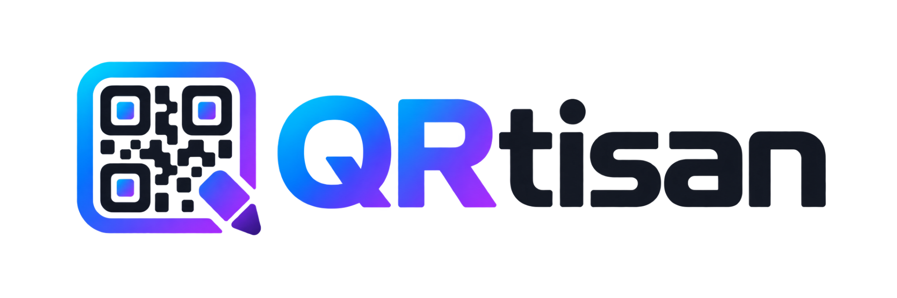

<p align="center">
  
</p>

# QRtisan — Local QR Code Designer

[Open app / Uygulamayı aç](https://gorlev.github.io/QRtisan/)

[English](#english) · [Türkçe](#türkçe)

## English

A QR code design workbench that runs **entirely in your browser**, with frames,
logos, colors, and module shapes. No account, server, or network connection is
required — the logo you upload and the content you enter never leave your device.

### Features

- **Content modes:** Website (URL), Text, Email (`mailto:` + subject/message), and
  Wi-Fi (WPA/WPA2, WEP, open, hidden network) — all with field-level validation and
  error messages. The URL field is not pre-filled with an example address;
  `example.com` is only a placeholder, and no QR code is generated until a valid
  address is entered, with export disabled until then. An empty field counts as
  "not entered yet": on first open, a friendly, localized waiting state is shown
  instead of a validation error.
- **Frames (7):** None, Thin border, Bottom label, Top label, Bubble (speech
  bubble), Corner marks (print corners), Badge. Label text is editable; long
  labels are automatically shrunk to fit the box (reduced by up to 55%, with a
  45% floor). With very wide glyphs or excessively long labels, this floor may
  still allow overflow; short text is recommended (see
  [`docs/PRD.md`](docs/PRD.md) §15.1; there is no universal "never overflows"
  guarantee).
- **Logo:** Local raster upload (PNG/JPEG/WebP, up to 2 MB, 24–4000 px),
  drag-and-drop, size/padding adjustment, a "clear modules underneath" option, and
  removal. When a logo is present, error correction is automatically locked to
  **H (30%)**.
- **Color:** Color picker + hex input + accessible preset palettes for
  foreground/background, ready-made color pairs, invert colors, transparent
  background, and a live WCAG contrast indicator.
- **Shapes:** 7 module shapes (square, soft, extra round, dots, classy, classy
  soft, diamond) and a 3×3 corner frame/eye combination. All shapes are chosen
  via SVG previews generated from the real geometry.
- **Preview:** Live drawing from the actual QR matrix, including frame, label, and
  logo. A print proof scene, quiet zone check, and scannability warnings
  (contrast, density, logo size, inverted colors, transparent background).
- **Export:** PNG (512/1024/2048 px) and SVG (scalable vector). The downloaded
  file matches the preview exactly; the file name follows
  `qrtisan-qr-YYYYMMDD-HHMM.(png|svg)` (the QR payload is not written into the
  file name). For the SVG label, **all bundled Manrope subsets** (latin,
  latin-ext, cyrillic, cyrillic-ext, greek, vietnamese) are embedded in the file
  with their own `unicode-range` declarations. Turkish İ, ş, ğ, Ş, Ğ glyphs live
  in `latin-ext`, so embedding only `latin` would produce mixed-font rendering.
- **Capacity management:** QR capacity is measured in **bytes**; multi-byte
  content (Turkish, emoji, CJK) fills it faster regardless of character count.
  With "Auto" error correction, if the content does not fit the requested level,
  the app drops to the highest level that fits and reports this as a warning. If
  the level is locked (by a logo or an explicit user choice) and the content does
  not fit, the app does not silently render an empty code: the form and preview
  show a call to action, and export is locked.
- **Presets:** 8 one-click designs; each is drawn as a real mini QR code.
- **Language:** Turkish and English interface. On the first visit, the language is
  resolved from the system: the first supported language in `navigator.languages`
  priority order wins (primary tag, case-insensitive: `tr-TR` → Turkish, `en-GB` →
  English); if the list is empty, `navigator.language` is tried, and if the system
  language is unsupported, it falls back to English. If the user makes an explicit
  choice from the TR/EN selector, the preference is written to the `kare-locale`
  key (the legacy key name is kept for backward compatibility) and overrides the
  system on subsequent visits. The automatically resolved default is not saved;
  therefore, until the user makes a choice, subsequent visits (and system language
  changes while the app is open) are observed. QR content, logo, and design are
  not affected.
- **Theme:** Light, dark, and system theme. The default is **system**: the OS
  scheme is observed live. Once a light theme is selected, OS changes do not alter
  the appearance. Because `color-scheme` is set correctly, native controls
  (sliders, select boxes, date pickers) match the theme. The theme is applied
  before the first paint by a small inline script in `index.html`, so there is no
  color flash on page load.
- **Sticky layout:** The top bar stays visible while scrolling; on desktop, the
  preview rail sticks below the top bar even when warnings are present. Warning
  titles and descriptions are visible without pressing a button; long lists scroll
  within their own area while the QR and download controls stay visible.
  On mobile (<1024 px), a separate studio layout is used: a sticky live mini QR
  under the top bar and a sticky "Preview & download" action in the bottom safe
  area. This action is hidden while a text input is focused or the on-screen
  keyboard is open, and returns when focus is lost (a deliberate exception). In
  the tap-to-open full-screen sheet, a large preview and PNG/SVG downloads are
  presented in a scrollable body flow (no fixed bottom bar); the sheet closes via
  the **X** in its header or **Esc**, does not close on outside click, and the
  sticky mini QR reappears when it closes.

### Quick Start

```bash
npm install
npm run dev
```

The development server opens at **http://localhost:5173** by default (if the port
is busy, Vite picks the next free port).

To try the production build locally:

```bash
npm run build
npm run preview   # http://localhost:4173
```

### Commands

| Command             | Description                                                       |
| ------------------- | ----------------------------------------------------------------- |
| `npm run dev`       | Development server (Vite, port 5173)                              |
| `npm run build`     | Type check + production build (`dist/`)                           |
| `npm run preview`   | Serves the built version (port 4173)                              |
| `npm run typecheck` | TypeScript type check                                             |
| `npm run lint`      | ESLint                                                            |
| `npm run test`      | Vitest unit + scan tests                                          |
| `npm run test:e2e`  | Playwright browser tests (starts its own server on port 5177)     |
| `npm run check`     | typecheck + lint + test + build                                   |

### What do the tests prove?

- **Scan tests (`src/lib/decode.test.ts`):** A real QR matrix is generated, the
  scene is drawn to PNG with Canvas 2D (or an SVG is generated and rasterized),
  and read back with two independent decoders: **ZXing** (`@zxing/library`, the
  engine behind most phone cameras) and **jsQR** (a stricter decoder). In
  addition, module centers in every image are compared against the QR matrix;
  this verifies at pixel level that the output is generated from the correct
  matrix. Multi-byte content and automatic level downgrade scenarios are scanned
  as well.
- **Typography tests (`src/lib/fonts.test.ts`):** Real woff2 files are opened with
  `fontkit`; the tests verify that the latin subset does not contain Turkish
  glyphs, that the union of the embedded subsets provides them, and that long
  Turkish labels are fitted into the box using real glyph metrics. SVG
  `@font-face` generation and family-name drift are tested as well.
- **Unit tests:** content/payload generation, URL/email/Wi-Fi validation
  (including IPv4 octets and local network names), UTF-8 byte length,
  code-point-safe truncation, contrast and readability calculations, frame layout
  geometry, shape paths, capacity/error-correction resolution, logo readiness
  derivation, and scannability warning rules.
- **Playwright tests (`e2e/studio.spec.ts`):** content entry, validation errors,
  frame/color/shape selection, logo upload/removal, PNG and SVG download
  (downloaded files are decoded with jsQR), keyboard tab navigation and
  `aria-controls` references, mobile layout, verification that **no external
  network requests are made**, multi-byte capacity flows, the logo replacement
  race, and that the **SVG label is drawn with the same metrics as the preview
  using the embedded font** (comparison of `getBBox()` against canvas measurement
  for Turkish and auto-shrunk long labels). It also verifies that an initial
  export made before the font loads expects the correct metrics, as proven by the
  PNG output being byte-for-byte identical.
- **Theme tests (`e2e/theme.spec.ts`):** system preference observes the OS scheme
  live, light preference is unaffected by OS changes, preference is preserved
  across reload (only preferences are stored), theme changes do **not** alter the
  QR canvas/colors/export by a single bit, top bar control labels in Turkish and
  English via the `locale` prop, inline init before first paint, and desktop/mobile
  text contrast in dark theme. Pure theme logic is covered by unit tests in
  `src/theme/theme.test.ts`.
- **Mobile and sticky layout tests (`e2e/mobile-studio.spec.ts`,
  `e2e/sticky-preview.spec.ts`):** overflow, touch targets, sheet open/close and
  state preservation at 320×568/390×667/844 and landscape 844×390 viewports;
  simulated safe area and `visualViewport` keyboard; the measured sticky rail and
  pinned downloads on desktop. `mobile-studio.spec.ts` also checks that the SVG
  header does not leak the raw Wi-Fi payload and that the QR can still be decoded.

### Architecture

```
src/
  lib/            pure, testable logic (independent of React)
    content.ts    content models, validation, QR payload generation
    qr.ts         real matrix generation with node-qrcode
    shapes.ts     SVG path generation for module/corner shapes
    geometry.ts   frame layout (all dimensions proportional to QR size)
    colors.ts     contrast, luminance, preset palettes
    warnings.ts   scannability warning rules
    locale.ts     UI language dictionary and translation helpers
    render/       scene → Canvas 2D and SVG drawing, PNG export
  components/     UI (accessible custom components)
  hooks/          state management and helper hooks
  theme/          theme preference logic and provider (light/dark/system)
  i18n/           language context (Turkish/English)
  styles/         layout layer (sticky preview)
  test/           test infrastructure (PNG rendering, jsQR/ZXing decoders)
e2e/              Playwright tests
```

Preview, PNG, and SVG **use the same scene model**, so all three outputs share
identical geometry.

### Privacy

- QR generation, image processing, and export all happen entirely on the client.
- The logo file is kept only in memory as a `data:` URL; it is never uploaded
  anywhere.
- **The only persistent data is preferences:** the theme (`kare-theme`) and, if
  the user explicitly chose it, the language (`kare-locale`) are stored in
  `localStorage`. These key names are historical and are not changed for backward
  compatibility; existing preferences are not reset (there is no migration). The
  language resolved automatically from the system is not saved. QR content, logo,
  colors, and design are never written to persistent storage; design and content
  fields reset when the page is reloaded (the URL field opens empty).
- If theme preference storage is blocked (private mode, etc.), the app does not
  crash; the preference stays in memory for that session only and the `system`
  default is used.
- During SVG download, font subsets (6 woff2 files) are read from the app's own
  bundle (a local request; no external network traffic).
- The SVG accessibility title (`aria-label`) is a generic, localized label
  ("QR code" / "QR kod"); the raw payload (including the Wi-Fi password) is not
  embedded in the title.
- **An exported QR exposes the content it encodes:** anyone who can read the QR
  (including a phone camera) sees the content. In Wi-Fi mode this includes the
  network name and the **password**; share the QR only with people you want to
  share the content with.
- **SVG may embed the logo's original bytes:** SVG export carries the logo as a
  `data:` URL; metadata present in the source image (e.g. EXIF) can remain inside
  the SVG. Keep this in mind before sharing.
- Documentation and examples use synthetic values only (`example.com`,
  `ornek@example.com`, etc.). Beyond preferences (theme/language), QR content and
  logo are not stored or transmitted anywhere.

### Limitations and Notes

- **Scannability is not guaranteed:** the app generates a correct QR matrix and
  warns about risks, but print quality, surface, and scanner differences affect
  the result. Always test with your phone before printing.
- **Decorative shapes:** discrete module shapes such as dots/diamond can challenge
  some strict decoders with very dense content. The app warns in this case; square
  modules are the most reliable option.
- **Decoder differences:** strict decoders such as jsQR may fail on some
  decorative shapes (e.g. dots/diamond) while ZXing and phone cameras read the
  same code. The test suite therefore applies an "at least one independent
  decoder" criterion for decorative shapes and "both decoders" for plain designs.
  There is also a known library behavior where ZXing JS fails at certain pixel
  alignments (e.g. exactly 1000 px wide); jsQR reads the same output.
- **SVG label:** All Manrope subsets are embedded with `unicode-range`, but some
  vector editors (e.g. Illustrator) ignore `@font-face` rules inside SVG and draw
  the label with their own system font. For an exact visual match, use PNG or make
  the font available in the document.
- **Capacity:** The UI limits text to 1200 UTF-16 code units; the real limit is
  byte capacity and is resolved by dropping the level under "Auto". Very dense
  codes (e.g. 160+ modules) are scannable only at sufficient resolution/size; the
  app reports this with a "data dense" warning. When the level is locked (by a
  logo or manual selection), export is locked for content that does not fit and a
  message is shown.
- **URL validation:** Local network names are accepted only when a scheme or port
  is specified (`http://nas`, `nas:5000`); bare single-word entries are rejected.
  In IPv4 addresses, every octet must be in the 0–255 range.
- **Logo:** Only raster formats are accepted (SVG is rejected due to script
  execution risk). The uploaded image is centered with its aspect ratio preserved.
  If the logo is being read/decoded or the image could not be opened, export stays
  locked; this state is clearly reported in the UI.
- **Wi-Fi:** The QR uses the Wi-Fi standard format `WIFI:T:...;S:...;P:...;;`;
  some operating systems may behave differently with hidden networks or WEP.
- **PNG sizes** are limited to 512/1024/2048 px; SVG scales without limit with a
  1000-unit viewBox.

### Public Release Notes

Things to keep in mind before this repository is made public:

- **`.gitignore` alone is not protection.** It does not hide a file that is
  already tracked, a file force-added with `git add -f`, a manually created ZIP
  archive, or a file uploaded as a release/attachment. The actual file list should
  also be checked before release.
- **Constants in a production build are always public.** Vite environment
  variables (`VITE_*`) and values embedded in the build can be read from the code
  that reaches the client even with sourcemaps disabled; they must not be used as
  secrets.
- **The development server must never be published** (`npm run dev` is local
  only).
- This document is **not a security certificate or an audit statement.** Release
  gate checks (see [`docs/PRD.md`](docs/PRD.md) §19) must be run before release
  and their results recorded.

### License

This repository is an educational/demo project. The dependencies are subject to
their own licenses (`qrcode` MIT, `react` MIT, `lucide-react` ISC, `@fontsource`
OFL, test tools under their own licenses). The license choice is the repository
owner's decision.

---

## Türkçe

**QRtisan — Yerel QR Kod Tasarımcısı**

Çerçeve, logo, renk ve modül şekilleriyle **tamamen tarayıcınızda** çalışan QR kod
tasarım tezgâhı. Hiçbir hesap, sunucu veya ağ bağlantısı gerekmez; yüklediğiniz
logo ve girdiğiniz içerik cihazınızdan çıkmaz.

### Özellikler

- **İçerik modları:** Web sitesi (URL), Metin, E-posta (`mailto:` + konu/mesaj) ve
  Wi-Fi (WPA/WPA2, WEP, şifresiz, gizli ağ) — hepsi alan bazlı doğrulama ve hata
  mesajlarıyla. URL alanı örnek adresle önceden doldurulmaz; `example.com` yalnızca
  yer tutucudur ve geçerli bir adres yazılana kadar QR üretilmez, dışa aktarma kapalı
  kalır. Boş alan "henüz girilmedi" sayılır: ilk açılışta doğrulama hatası yerine
  dostu, yerelleştirilmiş bir bekleme durumu gösterilir.
- **Çerçeveler (7):** Yok, İnce çerçeve, Alt etiket, Üst etiket, Kabarcık (konuşma
  balonu), Köşe izi (baskı köşeleri), Rozet. Etiket metni düzenlenebilir; uzun
  etiketler kutuya sığacak şekilde otomatik küçültülür (en fazla %55 küçültülür; taban
  boyutun %45'inin altına inilmez). Çok geniş glifli veya aşırı uzun etiketlerde bu taban
  taşmaya izin verebilir; kısa metin önerilir (bkz.
  [docs/PRD.md](docs/PRD.md) §15.1; evrensel "asla taşmaz" garantisi yoktur).
- **Logo:** Yerel raster yükleme (PNG/JPEG/WebP, en fazla 2 MB, 24–4000 px),
  sürükle-bırak, boyut/iç boşluk ayarı, "altındaki modülleri temizle" seçeneği ve
  kaldırma. Logo varken hata düzeltme otomatik olarak **H (%30)** seviyesine
  kilitlenir.
- **Renk:** Ön plan/arka plan için renk seçici + hex girişi + erişilebilir hazır
  paletler, hazır renk çiftleri, renkleri ters çevirme, şeffaf arka plan ve canlı
  WCAG kontrast göstergesi.
- **Şekiller:** 7 modül şekli (kare, yumuşak, çok yuvarlak, nokta, classy,
  classy yumuşak, elmas) ve 3×3 köşe çerçevesi/gözü kombinasyonu. Tüm şekiller
  gerçek geometriden üretilen SVG önizlemelerle seçilir.
- **Önizleme:** Gerçek QR matrisinden canlı çizim; çerçeve, etiket ve logo dahil.
  Baskı provası sahnesi, sessiz alan (quiet zone) denetimi ve taranabilirlik
  uyarıları (kontrast, yoğunluk, logo boyutu, ters renk, şeffaf zemin).
- **Dışa aktarma:** PNG (512/1024/2048 px) ve SVG (ölçeklenebilir vektör).
  İndirilen dosya önizlemeyle birebir aynıdır; dosya adı
  `qrtisan-qr-YYYYAAGG-SSDD.(png|svg)` biçimindedir (uluslararası gösterimle
  `YYYYMMDD-HHMM`; bu gösterim isteğe bağlıdır, zorunlu değildir; QR yükü dosya adına
  yazılmaz).
  SVG etiketi için Manrope'un
  **tüm paketlenmiş alt kümeleri** (latin, latin-ext, cyrillic, cyrillic-ext,
  greek, vietnamese) kendi `unicode-range` bildirimleriyle dosyanın içine gömülür.
  Türkçe İ, ş, ğ, Ş, Ğ glifleri `latin-ext` içinde olduğundan yalnızca `latin`
  gömmek karışık yazı tipi görünümüne yol açardı.
- **Kapasite yönetimi:** QR kapasitesi **bayt** cinsindendir; çok baytlı içerik
  (Türkçe, emoji, CJK) karakter sayısından bağımsız olarak daha hızlı dolar.
  "Otomatik" hata düzeltmede içerik istenen seviyeye sığmazsa sığan en yüksek
  seviyeye inilir ve bu durum uyarı olarak bildirilir. Seviye kilitliyse (logo
  veya kullanıcı seçimi) içerik sığmadığında sessizce boş kalmaz: formda ve
  önizlemede eylem çağrısı gösterilir, dışa aktarma kilitlenir.
- **Hazır tasarımlar:** 8 tek tıkla uygulanabilir tasarım; her biri gerçek mini QR
  olarak çizilir.
- **Dil:** Türkçe ve İngilizce arayüz. İlk ziyarette dil sistemden çözümlenir:
  `navigator.languages` öncelik sırasındaki ilk desteklenen dil kazanır
  (birincil etiket, büyük/küçük harf duyarsız: `tr-TR` → Türkçe, `en-GB` →
  İngilizce); liste boşsa `navigator.language` denenir, sistem dili
  desteklenmiyorsa İngilizceye düşülür. Kullanıcı TR/EN seçicisinden açıkça
  seçim yaparsa tercih `kare-locale` anahtarına yazılır (eski anahtar adı geriye
  dönük uyumluluk için korunur) ve sonraki ziyaretlerde
  sistemi geçersiz kılar. Otomatik çözümlenen varsayılan kaydedilmez; bu yüzden
  kullanıcı seçim yapana kadar sonraki ziyaretler (ve açıkken gelen sistem dil
  değişimleri) izlenir. QR içeriği, logo ve tasarım etkilenmez.
- **Tema:** Açık, koyu ve sistem teması. Varsayılan **sistem**dir: işletim
  sistemi şeması canlı izlenir. Açık bir tema seçildiğinde işletim sistemi
  değişimleri görünümü değiştirmez. `color-scheme` doğru ayarlandığı için
  yerel denetimler (kaydırıcı, seçim kutusu, tarih seçici) tema ile uyumludur.
  Tema, ilk boyamadan önce `index.html` içindeki küçük satır içi betikle
  uygulanır; sayfa açılırken renk sıçraması olmaz.
- **Yapışkan düzen:** Üst çubuk kaydırmada görünür kalır; masaüstünde önizleme
  rayı uyarılar varken de üst çubuğun altına yapışır. Uyarı başlık ve açıklamaları
  düğmeye basmadan görünür; uzun listeler kendi alanında kayarken QR ve indirme
  denetimleri görünür kalır.
  Mobilde (<1024 px) ayrı stüdyo düzeni kullanılır: üst çubuk altında yapışkan
  canlı mini QR ve alt güvenli alanda yapışkan "Önizle ve indir" eylemi. Bu eylem
  metin girişi odaktayken veya görsel klavye açıkken gizlenir, odak kaybında geri
  gelir (bilinçli istisna). Dokununca açılan tam ekran sheet'te büyük önizleme ve
  PNG/SVG indirme, kaydırılabilir gövde akışında sunulur (sabit alt şerit yoktur);
  sheet başlığındaki **X** veya **Esc** ile kapanır, dış tıklama ile kapanmaz ve
  kapanınca yapışkan mini QR yeniden görünür.

### Hızlı başlangıç

```bash
npm install
npm run dev
```

Geliştirme sunucusu varsayılan olarak **http://localhost:5173** adresinde açılır
(port doluysa Vite bir sonraki boş portu seçer).

Üretim derlemesini yerel olarak denemek için:

```bash
npm run build
npm run preview   # http://localhost:4173
```

### Komutlar

| Komut             | Açıklama                                                          |
| ----------------- | ----------------------------------------------------------------- |
| `npm run dev`     | Geliştirme sunucusu (Vite, port 5173)                             |
| `npm run build`   | Tip kontrolü + üretim derlemesi (`dist/`)                         |
| `npm run preview` | Derlenmiş sürümü sunar (port 4173)                                |
| `npm run typecheck` | TypeScript tip kontrolü                                         |
| `npm run lint`    | ESLint                                                            |
| `npm run test`    | Vitest birim + tarama testleri                                    |
| `npm run test:e2e` | Playwright tarayıcı testleri (port 5177'de sunucuyu kendisi açar) |
| `npm run check`   | typecheck + lint + test + build                                   |

### Testler neyi kanıtlıyor?

- **Tarama testleri (`src/lib/decode.test.ts`):** Gerçek QR matrisi üretilir, sahne
  Canvas 2D ile PNG'ye çizilir (veya SVG üretilip rasterleştirilir) ve bağımsız iki
  çözücüyle geri okunur: **ZXing** (`@zxing/library`, telefon kameralarının çoğunun
  motoru) ve **jsQR** (daha katı bir çözücü). Ek olarak her görüntüde modül
  merkezleri QR matrisiyle karşılaştırılır; bu, çıktının doğru matristen
  üretildiğini piksel düzeyinde doğrular. Çok baytlı içerik ve otomatik seviye
  düşürme senaryoları da taranır.
- **Tipografi testleri (`src/lib/fonts.test.ts`):** `fontkit` ile gerçek woff2
  dosyaları açılır; latin alt kümesinin Türkçe glifleri içermediği, gömülen alt
  kümelerin birleşiminin bunları sağladığı ve uzun Türkçe etiketlerin gerçek
  glif metrikleriyle kutuya sığdırıldığı doğrulanır. SVG `@font-face` üretimi ve
  aile adı sürüklenmesi ayrıca test edilir.
- **Birim testleri:** içerik/payload üretimi, URL/e-posta/Wi-Fi doğrulaması
  (IPv4 oktetleri ve yerel ağ adları dahil), UTF-8 bayt uzunluğu, kod noktası
  güvenli kısaltma, kontrast ve okunabilirlik hesapları, çerçeve yerleşim
  geometrisi, şekil yolları, kapasite/hata düzeltme çözümü, logo hazır olma
  türetmesi ve taranabilirlik uyarı kuralları.
- **Playwright testleri (`e2e/studio.spec.ts`):** içerik girme, doğrulama hataları,
  çerçeve/renk/şekil seçimi, logo yükleme/kaldırma, PNG ve SVG indirme (indirilen
  dosyalar jsQR ile çözülür), klavye ile sekme gezinme ve `aria-controls`
  referansları, mobil yerleşim, **hiçbir dış ağ isteği yapılmadığının**
  doğrulanması, çok baytlı kapasite akışları, logo değiştirme yarışı ve
  **SVG etiketinin gömülü yazı tipiyle önizlemeyle aynı metriklerde çizildiği**
  (Türkçe ve otomatik küçültülen uzun etiketler için `getBBox()` ↔ canvas ölçümü
  karşılaştırması) doğrulanır. Ayrıca yazı tipi yüklenmeden yapılan ilk dışa
  aktarmanın doğru metrikleri beklediği, PNG çıktısının bayt bayt aynı olmasıyla
  kanıtlanır.
- **Tema testleri (`e2e/theme.spec.ts`):** sistem tercihinin işletim sistemi
  şemasını canlı izlediği, açık tercihin OS değişimlerinden etkilenmediği,
  tercihin yeniden yüklemede korunduğu (yalnızca tercihlerin saklandığı),
  tema değişiminin QR tuvalini/renkleri/dışa aktarmayı **bit bit**
  değiştirmediği, üst çubuk denetiminin Türkçe ve `locale` prop'u ile İngilizce
  etiketleri, ilk boyama öncesi satır içi init ve karanlık temada masaüstü/mobil
  metin kontrastları doğrulanır. Saf tema mantığı `src/theme/theme.test.ts`
  içinde birim testleriyle kapsanır.
- **Mobil ve yapışkan düzen testleri (`e2e/mobile-studio.spec.ts`,
  `e2e/sticky-preview.spec.ts`):** 320×568/390×667/844 ve yatay 844×390
  görünümlerinde taşma, dokunma hedefleri, sheet aç/kapa ve durum korunumu;
  simüle edilmiş güvenli alan ve `visualViewport` klavyesi; masaüstünde ölçülen
  yapışkan ray ve pinli indirmeler doğrulanır. `mobile-studio.spec.ts` ayrıca
  SVG başlığının ham Wi-Fi yükünü sızdırmadığını, QR'ın yine çözülebildiğini
  kontrol eder.

### Mimari

```
src/
  lib/            saf, test edilebilir mantık (React'ten bağımsız)
    content.ts    içerik modelleri, doğrulama, QR yükü üretimi
    qr.ts         node-qrcode ile gerçek matris üretimi
    shapes.ts     modül/köşe şekillerinin SVG path üretimi
    geometry.ts   çerçeve yerleşimi (tüm ölçüler QR boyutuna oranlı)
    colors.ts     kontrast, parlaklık, hazır paletler
    warnings.ts   taranabilirlik uyarı kuralları
    locale.ts     arayüz dili sözlüğü ve çeviri yardımcıları
    render/       sahne → Canvas 2D ve SVG çizimi, PNG dışa aktarma
  components/     arayüz (erişilebilir özel bileşenler)
  hooks/          durum yönetimi ve yardımcı kancalar
  theme/          tema tercihi mantığı ve sağlayıcı (açık/koyu/sistem)
  i18n/           dil bağlamı (Türkçe/İngilizce)
  styles/         düzen katmanı (yapışkan önizleme)
  test/           test altyapısı (PNG çizimi, jsQR/ZXing çözücüler)
e2e/              Playwright testleri
```

Önizleme, PNG ve SVG **aynı sahne modelini** kullanır; bu yüzden üç çıktı birebir
aynı geometriye sahiptir.

### Gizlilik

- QR üretimi, görsel işleme ve dışa aktarma tamamen istemcide yapılır.
- Logo dosyası yalnızca bellekte `data:` URL olarak tutulur; hiçbir yere yüklenmez.
- **Tek kalıcı veri tercihlerdir:** tema (`kare-theme`) ve kullanıcı açıkça
  seçtiyse dil (`kare-locale`) `localStorage`'da saklanır. Bu anahtar adları
  tarihseldir ve geriye dönük uyumluluk için değiştirilmez; mevcut tercihler
  sıfırlanmaz (göç/taşıma yoktur). Sistemden otomatik
  çözümlenen dil kaydedilmez. QR içeriği, logo, renkler ve tasarım hiçbir zaman
  kalıcı depolamaya yazılmaz; sayfa yenilendiğinde tasarım ve içerik alanları
  sıfırlanır (URL alanı boş açılır).
- Tema tercihi depolama engelliyse (gizli mod vb.) uygulama çökmez; tercih
  yalnızca o oturumda bellekte kalır ve varsayılan `system` kullanılır.
- SVG indirme sırasında yazı tipi alt kümeleri (6 woff2 dosyası) uygulamanın kendi
  paketinden okunur (yerel istek; dış ağ trafiği yok).
- SVG'nin erişilebilirlik başlığı (`aria-label`) genel ve yerelleştirilmiş bir
  etikettir ("QR kod" / "QR code"); ham yük (Wi-Fi şifresi dahil) başlığa gömülmez.
- **Dışa aktarılan QR, kodlanan içeriği açığa çıkarır:** QR'ı okuyabilen herkes
  (telefon kamerası dahil) içeriği görür. Wi-Fi modunda bu, ağ adı ve **şifreyi**
  kapsar; QR'ı yalnızca içeriği paylaşmak istediğiniz kişilerle paylaşın.
- **SVG logonun özgün baytlarını gömebilir:** SVG dışa aktarımı logoyu `data:`
  URL olarak taşır; kaynak görselde bulunan meta veriler (ör. EXIF) SVG içinde
  kalabilir. Paylaşmadan önce bunu göz önünde bulundurun.
- Dokümantasyon ve örnekler yalnızca sentetik değerler kullanır (`example.com`,
  `ornek@example.com` gibi). QR içeriği ve logo, tercihlerin (tema/dil) ötesinde
  hiçbir yerde saklanmaz veya gönderilmez.

### Sınırlamalar ve notlar

- **Taranabilirlik garanti değildir:** Uygulama doğru QR matrisi üretir ve riskleri
  uyarır, ancak baskı kalitesi, yüzey ve tarayıcı farkları sonucu etkiler. Baskıdan
  önce mutlaka telefonunuzla okutun.
- **Dekoratif şekiller:** Nokta/elmas gibi ayrık modül şekilleri çok yoğun içerikte
  bazı katı çözücüleri zorlayabilir. Bu durumda uygulama uyarır; kare modüller en
  güvenilir seçenektir.
- **Çözücü farkları:** jsQR gibi katı çözücüler bazı dekoratif şekillerde (ör.
  nokta/elmas) başarısız olabilirken ZXing ve telefon kameraları aynı kodu okur.
  Test paketi bu nedenle dekoratif şekillerde "en az bir bağımsız çözücü", sade
  tasarımlarda "her iki çözücü" ölçütünü uygular. Ayrıca ZXing JS'in belirli
  piksel hizalamalarında (örn. tam 1000 px genişlik) başarısız olduğu bilinen bir
  kütüphane davranışı vardır; aynı çıktıyı jsQR okur.
- **SVG etiketi:** Manrope'un tüm alt kümeleri `unicode-range` ile gömülür, ancak
  bazı vektör editörleri (ör. Illustrator) SVG içindeki `@font-face` kurallarını
  yok sayar ve etiketi kendi sistem yazı tipiyle çizer. Birebir görsel eşleşme
  için PNG kullanın veya yazı tipini belgede kullanılabilir hale getirin.
- **Kapasite:** Arayüz metni 1200 UTF-16 kod birimiyle sınırlar; gerçek sınır ise
  bayt kapasitesidir ve "Otomatik" seçimde seviye düşürülerek çözülür. Çok yoğun
  kodlar (ör. 160+ modül) yalnızca yeterli çözünürlükte/boyutta taranabilir;
  uygulama bu durumu "veri yoğun" uyarısıyla bildirir. Seviye kilitliyken (logo
  veya elle seçim) sığmayan içerik için dışa aktarma kilitlenir ve mesaj gösterilir.
- **URL doğrulaması:** Yerel ağ adları yalnızca şema veya port belirtilmişse kabul
  edilir (`http://nas`, `nas:5000`); çıplak tek kelime girdiler reddedilir. IPv4
  adreslerinde her oktet 0–255 aralığında olmalıdır.
- **Logo:** Yalnızca raster formatlar kabul edilir (SVG, betik çalıştırma riski
  nedeniyle reddedilir). Yüklenen görsel oranı korunarak ortalanır. Logo
  okunurken/çözülürken veya görsel açılamadıysa dışa aktarma kilitli kalır; bu
  durum arayüzde açıkça bildirilir.
- **Wi-Fi:** QR, Wi-Fi standardındaki `WIFI:T:...;S:...;P:...;;` biçimini kullanır;
  bazı işletim sistemleri gizli ağlarda veya WEP'te farklı davranabilir.
- **PNG boyutları** 512/1024/2048 px ile sınırlıdır; SVG 1000 birimlik viewBox ile
  sınırsız ölçeklenir.

### Kamuya açık yayın notları

Bu depo kamuya açılmadan önce göz önünde tutulması gerekenler:

- **`.gitignore` tek başına koruma değildir.** Zaten izlenen bir dosyayı, `git add -f`
  ile zorla eklenen dosyayı, elle oluşturulan ZIP arşivini veya sürüm/ek (release
  attachment) olarak yüklenen dosyayı gizlemez. Yayın öncesi gerçek dosya listesi
  ayrıca kontrol edilmelidir.
- **Üretim derlemesindeki sabitler her zaman geneldir.** Vite ortam değişkenleri
  (`VITE_*`) ve derlemeye gömülen değerler, kaynak haritası (sourcemap) kapalı olsa
  bile istemciye inen koddan okunabilir; sır olarak kullanılmamalıdır.
- **Geliştirme sunucusu asla yayınlanmamalıdır** (`npm run dev` yalnızca yereldir).
- Bu belge bir **güvenlik sertifikası veya denetim beyanı değildir.** Yayın kapısı
  kontrolleri (bkz. `docs/PRD.md` §19) yayın öncesi çalıştırılmalı ve sonuçları
  kayda geçirilmelidir.

### Lisans

Bu depo bir eğitim/demo projesidir. Kullanılan bağımlılıklar kendi lisanslarına
tabidir (`qrcode` MIT, `react` MIT, `lucide-react` ISC, `@fontsource` OFL, test
araçları kendi lisansları). Lisans seçimi depo sahibinin kararıdır.
