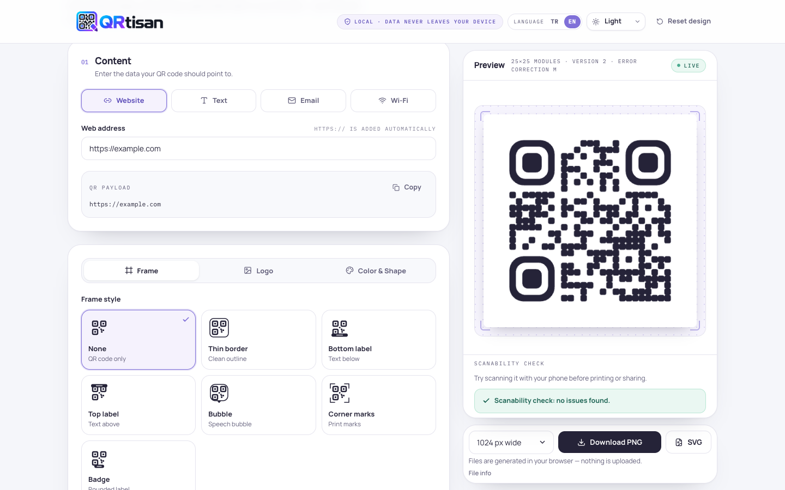

<p align="center">
  
</p>

<p align="center">
  <strong>Design a QR code. Make it yours. Keep your data local.</strong>
</p>

<p align="center">
  <a href="https://gorlev.github.io/QRtisan/">Open QRtisan</a> ·
  <a href="README.tr.md">Türkçe</a> ·
  <a href="#development">Development</a>
</p>

QRtisan is a browser-based QR code design studio for links, text, email, and Wi-Fi.
Customize the colors, shapes, frame, and logo, then export a PNG or SVG for print
or digital use. No account required. Your content and uploaded images are processed
on your device.

<picture>
  <source media="(prefers-color-scheme: dark)" srcset="docs/images/studio-dark.png" />
  
</picture>

## What you can create

| Capability | Options |
| --- | --- |
| **Content** | Website links, plain text, email with subject and message, Wi-Fi credentials |
| **Design** | 7 frame styles, editable labels, 7 module shapes, customizable corner shapes |
| **Branding** | PNG, JPEG, or WebP logo; adjustable size and padding |
| **Color** | Custom colors, preset palettes, inverted colors, transparent background |
| **Export** | PNG at 512, 1024, or 2048 px; scalable SVG |
| **Workspace** | 8 design presets, Turkish and English, light and dark themes |

The preview updates as you edit. On desktop, the QR and download controls follow
you as you scroll. On mobile, a compact live preview and a dedicated preview and
download panel keep the editor usable on small screens.

## From content to download

1. **Choose your content.** Enter a link, text, email, or Wi-Fi details.
2. **Build your design.** Start with a preset or adjust the frame, colors, shapes, and logo.
3. **Review and export.** Check the scannability warnings and download your PNG or SVG.

Test the exported code with a phone before printing or sharing. Decorative shapes,
low contrast, large logos, and dense content can affect scanning.

## Privacy

QR generation, logo processing, and export run in your browser. There is no
application backend, and QR content and uploaded logos are not sent to a server.
The hosted site still loads its application files and fonts from GitHub Pages.

Only theme and explicitly selected language preferences are saved in local storage.
Content and designs stay in memory and reset when you reload the page.

An exported QR contains the information you entered, including a password in Wi-Fi
mode. SVG exports also embed the uploaded logo, which may retain image metadata.

## Development

**Requirements:** Node.js 20.19+ and npm. The deployment workflow uses Node.js 24.

```bash
git clone https://github.com/gorlev/QRtisan.git
cd QRtisan
npm ci
npm run dev
```

Open [localhost:5173](http://localhost:5173). If the port is occupied, Vite selects
the next available port.

### Commands

| Command | Purpose |
| --- | --- |
| `npm run dev` | Start the development server |
| `npm run build` | Check types and build to `dist/` |
| `npm run preview` | Serve the production build at port 4173 |
| `npm run check` | Run type checking, lint, unit tests, and build |
| `npm run test:e2e` | Run Playwright browser tests |

For browser tests, install Chromium once:

```bash
npx playwright install chromium
npm run test:e2e
```

### How it works

Built with **React, TypeScript, Vite, and Tailwind CSS**. The `qrcode` library
produces the QR matrix. A shared scene model renders the preview, PNG, and SVG,
keeping their geometry consistent.

| Directory | Responsibility |
| --- | --- |
| `src/lib/` | Content validation, QR generation, geometry, colors, and warnings |
| `src/lib/render/` | Shared scene model, Canvas and SVG rendering, export |
| `src/components/` | Editor, preview, and export interface |
| `src/hooks/` | Studio state and responsive layout behavior |
| `src/i18n/`, `src/theme/` | Language and theme preferences |
| `e2e/` | Browser workflows and responsive layout tests |

Vitest covers validation, rendering, typography, and QR decoding with jsQR and
ZXing. Playwright covers editing, downloads, localization, themes, and responsive
behavior. Detailed requirements are in [the product specification](docs/PRD.md).

## Deployment

The [Pages workflow](.github/workflows/pages.yml) checks and builds the application,
then publishes it to [gorlev.github.io/QRtisan](https://gorlev.github.io/QRtisan/) on
every push to `main`. GitHub Pages uses GitHub Actions as its publishing source.

To reproduce the Pages build locally:

```bash
npm run build -- --base=/QRtisan/
npm run preview
```

Open [localhost:4173/QRtisan/](http://localhost:4173/QRtisan/).

## Practical limits

- **Logos:** PNG, JPEG, or WebP; up to 2 MB; each dimension between 24 and 4000 px.
- **Capacity:** Depends on encoded bytes and error correction. A logo requires
  level H; content that exceeds the selected level's capacity cannot be exported.
- **Labels:** Short labels work best. Very long text can exceed the frame's fitting limits.
- **SVG typography:** Some vector editors ignore embedded fonts. Use PNG when an
  exact visual match is essential.
- **Scanning:** On-screen checks highlight risks; they cannot guarantee results on
  every scanner, printed surface, or output size.

## License

No project license has been selected yet. Dependencies retain their respective licenses.
